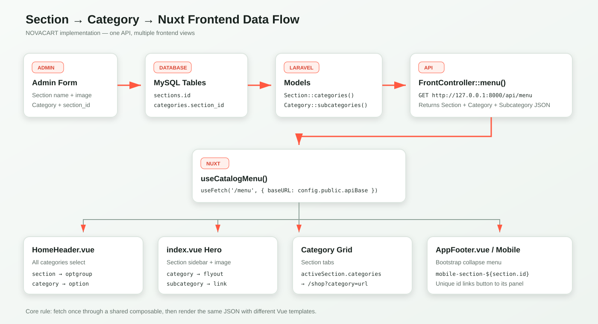
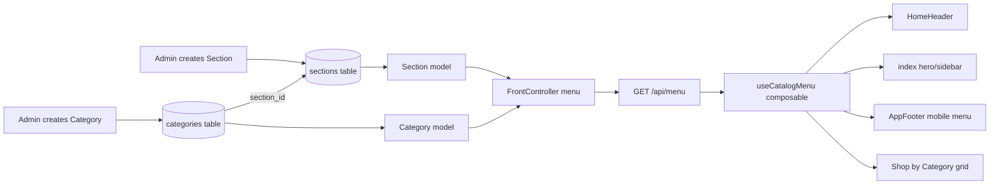
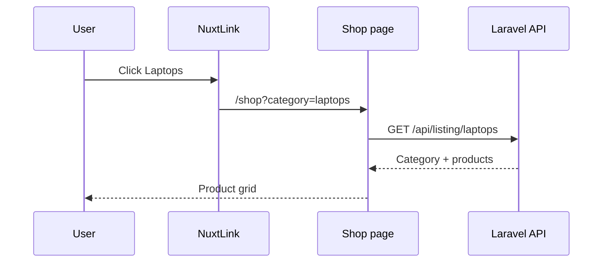

# Laravel API → Nuxt 4: Dynamic Section, Category ও Product Guide

এই document-টি NOVACART project-এর বর্তমান implementation ধরে লেখা। একই pattern অন্য project-এও ব্যবহার করা যাবে।



## 1. শেষ ফলাফল কী?

Admin panel থেকে Section ও Category তৈরি করলে frontend-এর নিচের জায়গাগুলো API থেকে নিজে নিজে data দেখায়:

- Home hero sidebar
- Sidebar hover flyout
- Header-এর `All categories` select
- Mobile menu
- Home page-এর `Shop by Category` tabs/grid
- Category click করলে Shop page-এ category URL query যায়

## 2. সম্পূর্ণ data-flow diagram



সহজ ভাষায়:

```text
Database → Laravel Model → FrontController → /api/menu
         → Nuxt useCatalogMenu() → Header / Hero / Mobile / Category grid
```

## 3. Database relationship

```text
sections
├── id
├── name
├── image
└── status

categories
├── id
├── section_id  ──────────► sections.id
├── parent_id   ──────────► categories.id
├── category_name
├── image
├── url
└── status
```

- `section_id` বলে Category কোন Section-এর অধীনে।
- `parent_id = 0` হলে এটি root Category।
- `parent_id = অন্য category id` হলে এটি Subcategory।

Section image column যোগ করার migration:

```php
Schema::table('sections', function (Blueprint $table) {
    $table->string('image')->nullable()->after('name');
});
```

File: `adminpanel/database/migrations/2026_08_15_000001_add_image_to_sections_table.php`

## 4. Section image upload কীভাবে connected?

### Model

`Section.php`-তে database-এ image save করার permission:

```php
protected $fillable = ['name', 'image', 'status'];
```

Frontend-এর জন্য full image URL তৈরি:

```php
protected $appends = ['image_url'];

public function getImageUrlAttribute(): ?string
{
    return $this->image
        ? asset('admin/sectionimage/'.basename($this->image))
        : null;
}
```

ফলে API-তে দুটি value পাওয়া যায়:

```json
{
  "image": "section_xxx.webp",
  "image_url": "http://127.0.0.1:8000/admin/sectionimage/section_xxx.webp"
}
```

Frontend-এ সবসময় `image_url` ব্যবহার করতে হবে। শুধু `image` ব্যবহার করলে filename পাওয়া যাবে, পূর্ণ URL নয়।

### Controller

Validation:

```php
'image' => ['nullable', 'image', 'mimes:jpeg,jpg,png,gif,webp', 'max:8192'],
```

Upload:

```php
if ($request->hasFile('image')) {
    $data['image'] = $this->uploadImage($request->file('image'));
}
```

Storage:

```php
return $this->images->store(
    $file,
    'admin/sectionimage',
    'section',
    1200,
    1200,
    84
);
```

এতে image optimized WebP হয়ে `public/admin/sectionimage`-এ save হয়। Update-এর সময় নতুন image এলে পুরোনোটি delete হয়।

Relevant file: `adminpanel/app/Http/Controllers/SectionController.php`

## 5. Model relationship কীভাবে কাজ করে?

Section model:

```php
public function categories(): HasMany
{
    return $this->hasMany(Category::class)
        ->where('parent_id', 0)
        ->where('status', true)
        ->with(['subcategories', 'products.brand']);
}
```

এর অর্থ:

1. একটি Section-এর অনেক Category আছে।
2. এখানে শুধু root Category নেওয়া হচ্ছে।
3. প্রতিটি root Category-এর Subcategory ও Product-ও load হচ্ছে।

তারপর:

```php
public static function sections(): array
{
    return self::with('categories')
        ->where('status', true)
        ->get(['id', 'name', 'image'])
        ->toArray();
}
```

এটি active Section এবং nested Category tree তৈরি করে।

## 6. API কীভাবে তৈরি হয়েছে?

Route:

```php
Route::get('/menu', [FrontController::class, 'menu']);
```

Controller:

```php
public function menu(): JsonResponse
{
    $sections = Cache::remember(
        'api.sections-with-categories.v4',
        now()->addHours(6),
        fn () => Section::sections(),
    );

    return response()->json([
        'status' => true,
        'categories' => $sections,
    ]);
}
```

বর্তমান response-এ `categories` নামের property-র ভেতরে আসলে Section list আছে:

```json
{
  "status": true,
  "categories": [
    {
      "id": 1,
      "name": "Electronics",
      "image_url": "http://.../electronics.webp",
      "categories": [
        {
          "id": 3,
          "category_name": "Laptops",
          "url": "laptops",
          "image_url": "http://.../laptops.webp",
          "subcategories": []
        }
      ]
    }
  ]
}
```

মনে রাখার formula:

```text
data.categories                  = Section array
data.categories[0].categories    = Category array
category.subcategories           = Subcategory array
```

## 7. Nuxt API base URL

`frontend/nuxt.config.ts`:

```ts
runtimeConfig: {
  public: {
    apiBase: 'http://127.0.0.1:8000/api'
  }
}
```

এখন `baseURL + /menu` মিলে হয়:

```text
http://127.0.0.1:8000/api/menu
```

`nuxt.config.ts` পরিবর্তনের পরে Nuxt dev server restart করতে হয়।

## 8. Shared composable কেন তৈরি করা হয়েছে?

একই API Header, Home page ও Mobile menu-তে দরকার। প্রতিটি component-এ fetch code copy না করে একটি reusable composable করা হয়েছে:

```ts
export const useCatalogMenu = () => {
  const config = useRuntimeConfig()

  return useFetch('/menu', {
    baseURL: config.public.apiBase,
    key: 'catalog-menu'
  })
}
```

File: `frontend/app/composables/useCatalogMenu.ts`

`key: 'catalog-menu'` একই data-কে Nuxt-এর shared async-data cache-এ চিহ্নিত করে।

যেকোনো component-এ ব্যবহার:

```vue
<script setup>
const { data, pending, error } = await useCatalogMenu()

const sections = computed(() =>
  data.value?.categories ?? []
)
</script>
```

`?? []` দেওয়ার কারণ: API data আসার আগে template যেন `undefined` loop করে crash না করে।

## 9. Hero sidebar dynamic করা

```vue
<div
  v-for="section in sections"
  :key="section.id"
  class="desktop-category-item"
>
  <NuxtLink :to="{ path: '/shop', query: { section: section.id } }">
    <span>
      
      {{ section.name }}
    </span>
  </NuxtLink>
</div>
```

গুরুত্বপূর্ণ Vue syntax:

| Code | কাজ |
|---|---|
| `v-for` | Array-এর প্রতিটি item দেখায় |
| `:key` | Vue-কে প্রতিটি row আলাদাভাবে চিনতে সাহায্য করে |
| `v-if` | Image থাকলেই `` দেখায় |
| `:src` | JavaScript value image source-এ bind করে |
| `:to` | Dynamic Nuxt route তৈরি করে |

Image size:

```css
.sidebar-section-image {
  width: 22px;
  height: 22px;
  object-fit: contain;
}
```

`object-fit: contain` image crop না করে box-এর মধ্যে সম্পূর্ণ image দেখায়।

### `sectionIcons` কেন ছিল?

```js
const sectionIcons = ['bi-phone', 'bi-bag', 'bi-house-heart']
const sectionIcon = index => sectionIcons[index % sectionIcons.length]
```

এটি API বা database connection নয়। কোনো Section-এর `image_url` না থাকলে শুধু fallback Bootstrap icon দেখানোর জন্য:

```vue

<i v-else class="bi" :class="sectionIcon(index)"></i>
```

সব Section-এ image বাধ্যতামূলক হলে array/function এবং `<i v-else>`—তিনটিই সরানো যায়। Fallback রাখতে চাইলে এগুলো রাখবেন।

## 10. Category ও Subcategory flyout

```vue
<div class="category-flyout">
  <div v-for="category in section.categories" :key="category.id">
    <h3>{{ category.category_name }}</h3>

    <NuxtLink
      v-for="subcategory in category.subcategories"
      :key="subcategory.id"
      :to="{
        path: '/shop',
        query: { category: subcategory.url }
      }"
    >
      {{ subcategory.category_name }}
    </NuxtLink>
  </div>
</div>
```

Nested loop:

```text
Section loop
└── Category loop
    └── Subcategory loop
```

## 11. Section tabs ও Category cards

Selected Section মনে রাখার জন্য:

```js
const activeSectionId = ref(sections.value[0]?.id ?? null)

const activeSection = computed(() =>
  sections.value.find(
    section => section.id === activeSectionId.value
  ) ?? sections.value[0] ?? null
)
```

Tab click:

```vue
<button
  v-for="section in sections"
  :key="section.id"
  @click="activeSectionId = section.id"
>
  {{ section.name }}
</button>
```

Active Section-এর Category:

```vue
<NuxtLink
  v-for="category in activeSection.categories"
  :key="category.id"
  :to="{
    path: '/shop',
    query: { category: category.url }
  }"
>
  
  <strong>{{ category.category_name }}</strong>
</NuxtLink>
```

## 12. Header select dynamic করা

```vue
<select>
  <option value="">All categories</option>

  <optgroup
    v-for="section in sections"
    :key="section.id"
    :label="section.name"
  >
    <option
      v-for="category in section.categories"
      :key="category.id"
      :value="category.url"
    >
      {{ category.category_name }}
    </option>
  </optgroup>
</select>
```

এখানে `<optgroup>` Section এবং `<option>` Category।

## 13. Mobile menu dynamic করা

Bootstrap collapse-এর প্রতিটি id unique হতে হবে:

```js
const mobileSectionId = section =>
  `mobile-section-${section.id}`
```

```vue
<button
  data-bs-toggle="collapse"
  :data-bs-target="`#${mobileSectionId(section)}`"
>
  {{ section.name }}
</button>

<div
  class="collapse"
  :id="mobileSectionId(section)"
>
  <!-- categories -->
</div>
```

Section id `3` হলে result:

```html
<button data-bs-target="#mobile-section-3">
<div id="mobile-section-3">
```

এই matching-এর কারণেই সঠিক Section click করলে সঠিক Category panel open হয়।

## 14. Category click করলে কী হয়?

```vue
<NuxtLink
  :to="{
    path: '/shop',
    query: { category: category.url }
  }"
>
```

`category.url = laptops` হলে browser URL:

```text
/shop?category=laptops
```



বর্তমানে link/query তৈরি হচ্ছে। Shop page-এ `/listing/{url}` fetch ও product binding করলে flow সম্পূর্ণ dynamic হবে।

## 15. Product details flow

Category listing response-এর প্রতিটি product link:

```vue
<NuxtLink :to="`/product/${product.id}`">
  {{ product.product_name }}
</NuxtLink>
```

Product page API:

```text
GET /api/detail/{id}
```

সম্পূর্ণ URL flow:

```text
/api/menu
   ↓ category click
/shop?category=laptops
   ↓ listing API
/api/listing/laptops
   ↓ product click
/product/15
   ↓ details API
/api/detail/15
```

## 16. Cache কেন clear করা হয়?

Menu API ৬ ঘণ্টা cache হয়। Admin থেকে Section/Category update করার পর cache clear না করলে frontend পুরোনো data দেখাতে পারে।

```php
Cache::forget('api.sections-with-categories.v4');
```

Development-এ প্রয়োজনে:

```bash
php artisan optimize:clear
```

Browser-এ:

```text
Ctrl + F5
```

## 17. আমি কোন file-এ কী করেছি?

| File | দায়িত্ব |
|---|---|
| `SectionController.php` | Section image validate, upload, replace, delete |
| `Section.php` | image fillable, image URL, Category relationship |
| `FrontController.php` | Section/Category JSON response |
| `routes/api.php` | `/menu`, `/listing/{url}`, `/detail/{id}` |
| `nuxt.config.ts` | Laravel API base URL |
| `useCatalogMenu.ts` | Shared `/menu` fetch function |
| `index.vue` | Hero sidebar, flyout, Section tabs, Category grid |
| `HomeHeader.vue` | Header category select |
| `AppFooter.vue` | Mobile navigation/offcanvas |

## 18. অন্য project-এ করার checklist

1. `sections` table তৈরি করুন।
2. `categories.section_id` foreign key দিন।
3. Section ও Category model relationship তৈরি করুন।
4. Active Section/Category return করা `/api/menu` endpoint বানান।
5. Image-এর full `image_url` API-তে দিন।
6. Nuxt `runtimeConfig.public.apiBase` সেট করুন।
7. Shared `useCatalogMenu()` composable বানান।
8. Component-এ `computed(() => data.value?.categories ?? [])` লিখুন।
9. Section-এর জন্য outer `v-for` দিন।
10. Category-এর জন্য nested `v-for` দিন।
11. Dynamic link-এ category `url` ব্যবহার করুন।
12. Loading, error ও empty state রাখুন।
13. Uploaded image-এ fixed size এবং `object-fit` দিন।
14. Bootstrap collapse id unique করুন।
15. Cache invalidation এবং production build পরীক্ষা করুন।

## 19. Common ভুল ও সমাধান

### 404 API error

ভুল:

```js
useFetch('/categories')
```

যদি route শুধু `/menu` হয়, সঠিক:

```js
useFetch('/menu')
```

### `API Error: undefined`

এটি error নয়। `error.value` empty মানে request সফল।

### Image filename আছে, image দেখা যায় না

ভুল:

```vue

```

সঠিক:

```vue

```

### Reload দিলে কাজ করে, NuxtLink navigation-এ করে না

সাধারণত plain DOM script শুধু initial load-এ initialize হয়েছে। Filter/tab logic Vue `ref`, `computed` ও `@click` দিয়ে লিখুন।

### Design ভেঙে যায়

- Existing wrapper/class পরিবর্তন করবেন না।
- Static repeated item-এর জায়গায় শুধু `v-for` বসান।
- Image width/height fixed রাখুন।
- `object-fit: contain` বা `cover` প্রয়োজন অনুযায়ী দিন।
- Mobile breakpoint পরীক্ষা করুন।

## 20. সবচেয়ে ছোট reusable example

```vue
<script setup>
const config = useRuntimeConfig()

const { data } = await useFetch('/menu', {
  baseURL: config.public.apiBase
})

const sections = computed(() =>
  data.value?.categories ?? []
)
</script>

<template>
  <section v-for="section in sections" :key="section.id">
    
    <h2>{{ section.name }}</h2>

    <NuxtLink
      v-for="category in section.categories"
      :key="category.id"
      :to="{
        path: '/shop',
        query: { category: category.url }
      }"
    >
      {{ category.category_name }}
    </NuxtLink>
  </section>
</template>
```

এই ছোট pattern বুঝলেই Header, Sidebar, Mobile menu এবং Category grid—সব জায়গায় একই data আলাদা design-এর মধ্যে দেখাতে পারবেন।
